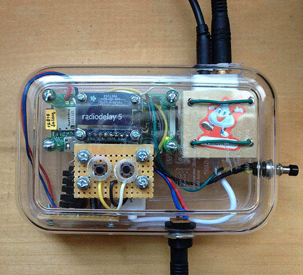

# RadioDelay

Python program using PyAudio to add variable delay to audio input. Intended for syncing baseball radio broadcasts to television. Works run from command line and also on a headless raspberry pi with gpio buttons to adjust the delay.

## Arguments
- delay: set an initial delay (in seconds).
- ssd: 0 or 1 to activate the raspberry pi portions of the code. ssd1306 display and buttons to set delay.
- interactive: 0 or 1 to accept command line input for setting delay. 

working prototype with a pi zero and <a href="https://www.adafruit.com/product/661">oled display</a>. Uses <a href="https://www.adafruit.com/product/1475">this</a> usb sound card. The panel mount switch is used for <a href="https://github.com/adafruit/Adafruit-GPIO-Halt">shutdown</a>

## License

[GPLv3+](https://www.gnu.org/licenses/gpl-3.0.html)